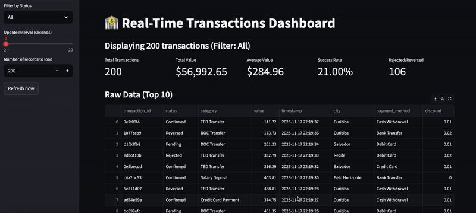
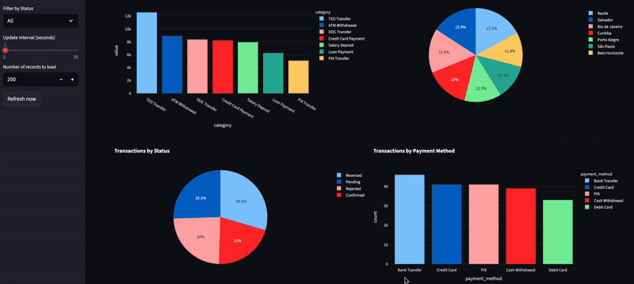

# IDS706_assignment_08
This is a repository for [assignment 8: Real-Time Streaming System with Apache Kafka](https://canvas.duke.edu/courses/60978/assignments/300641). This is based on [Real Time Streaming](https://sordid-plot-c78.notion.site/Real-Time-Streaming-29f45dca7a3e80eea4d7dea3ac3f1aad)


# Real-Time Transaction Streaming Pipeline

This project demonstrates a real-time data streaming pipeline for financial transactions using Kafka, PostgreSQL, and Streamlit.

## Features

**Producer:** Generates synthetic transaction data continuously


**Kafka:** Streams transactions in real time

**Consumer:** Persists transactions to PostgreSQL


**Dashboard:** Live visualization of transaction KPIs and trends




## Dashboard Highlights

- Total transactions and total value

- Average transaction amount

- Transaction status distribution (Completed, Failed, Pending)

- Transactions by category, city, or payment method

- Auto-refreshing every few seconds

## Project Structure
```python
transaction_pipeline/
├── docker-compose.yml
├── requirements.txt
├── producer.py
├── consumer.py
└── dashboard.py
```


## Steps

### Setup

- Install dependencies
- pip install -r requirements.txt


### Start Docker services

``` python
docker-compose up -d
sleep 30
```


### Create Kafka topic
```python
docker exec -it kafka kafka-topics --create --topic transactions --bootstrap-server localhost:9092 --partitions 1 --replication-factor 1
```

### Run the Pipeline

#### Start Consumer
```python
python consumer.py
```

#### Start Producer
``` python
python producer.py
```

#### Launch Dashboard
``` python
streamlit run dashboard.py
```